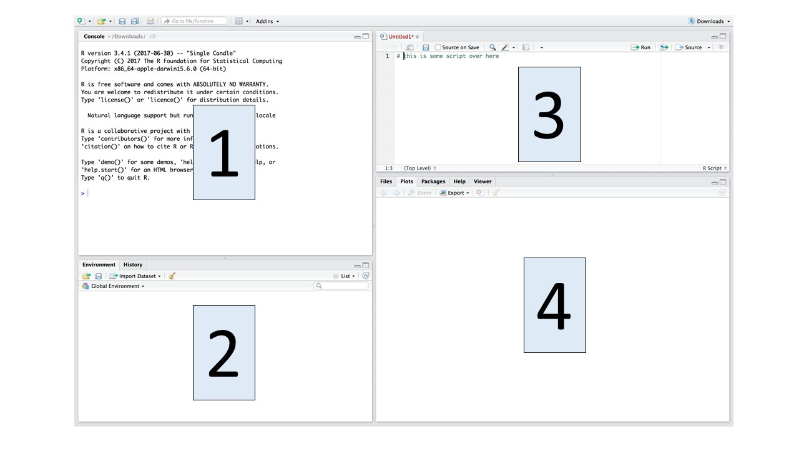

# Finding your way around RStudio

R studio has 4 windows (also known as "panes") that are inter-linked. The default layout is shown in Figure \@ref(fig:panes). You can move the layout of the panes and change their size and shape by clicking and dragging with your mouse along the window pane borders. The details of what happens in each pane are detailed below.

```{r panes, fig.cap="Panes in RStudio.", fig.align='center', out.width="70%", fig.show='hold', echo=FALSE}

```

## Source pane

This is where you create and edit R scripts. R scripts are just text files with a ".R" extension at the end of the filename. When you've written and saved a script, you can re-use it for future projects. So, before you start typing here, you should save the file under a new name. 

## Console pane

On the surface, this looks a lot like the source pane, since it's where you can also type code. However, it differs because there is a prompt (the ">" symbol) and here the code is actually evaluated.

- TRY IT! type 5 + 5 in the console at the prompt and press "enter". You'll see the R gives the correct output (10).

**TIP** you should try to type code in the source pane, so it gets saved. You can test it by clicking the "Run" button on the top of the source pane. 

**TIP** use the console to test code/debug, or do a quick analysis. If you want to see a previous line of code you types, press the up arrow to scorss through past comments, from most to least recent.

## Enviornment/History pane

This pane has several tabs, we'll discuss each in turn.

### Environment tab

This shows you the names of all data objects (e.g., vectors, matrices, dataframes) that you've defined in the current R session, along with information about the size of data objects. 

There are also clickable actions, like "Import data set", which we'll refer to later.

### History tab

This shows you a history of all the code you've previously run in the console. 

## File/Plots/Packages/Help pane

This pane also has a few tabs

### Files tab

This tab gives you access to the file directory on your own computer. It's a useful spot to set your working directory (see Chapter \@ref(load-data)).

### Plots tab

This tab lets you see all the plots (graphs) that you create. You can also uset the buttons at the top to zoom, and to export the graph as a PDF or jpeg file.

### Packages tab

This tab shows a list of all the R packages installed on your computer (see chapter 5 for more on installing packages). It also indicates which are loaded with a check mark.

### Help tab

This lets you get help with R functions. Type the name of the function in the search window (blank bar with the magnifying glass beside it). See Chapter \@ref(help) "Getting R help" for more details.

